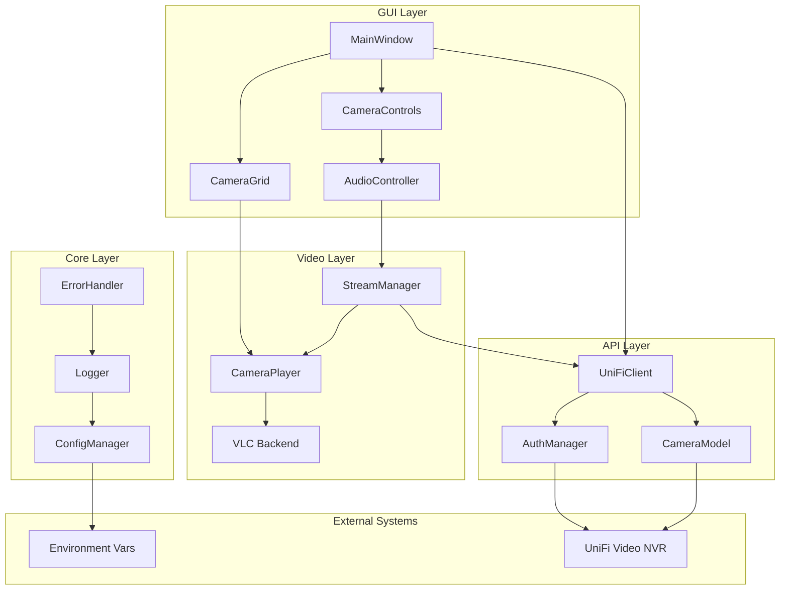
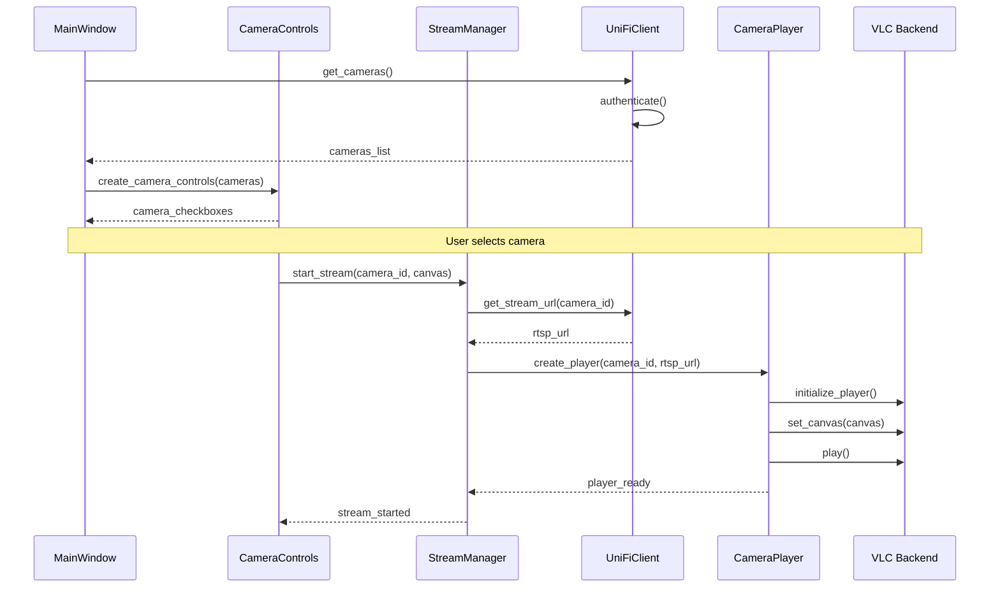
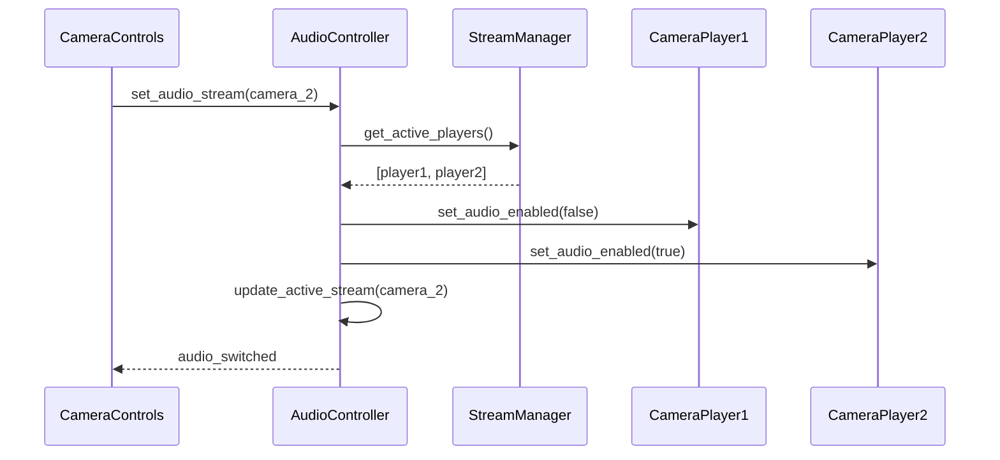

# camera-live-view - Task 1.3

Execute task 1.3 for the camera-live-view specification.

## Task Description
Create `__init__.py` files in all package directories

## Usage
```
/Task:1.3-camera-live-view
```

## Instructions

Execute with @spec-task-executor agent the following task: "Create `__init__.py` files in all package directories"

```
Use the @spec-task-executor agent to implement task 1.3: "Create `__init__.py` files in all package directories" for the camera-live-view specification and include all the below context.

# Steering Context
## Steering Documents Context (Pre-loaded)

### Product Context
# Product Vision - GeekTime Cam

## Overview
Multi-camera surveillance viewer application for UniFi Video NVR systems, designed for business security monitoring and management.

## Target Users
- **Primary**: Security personnel and surveillance operators
- **Secondary**: Business administrators managing security systems
- **Use Case**: Professional business surveillance monitoring with real-time and historical video review capabilities

## Core Features

### Live Monitoring Mode
- Real-time video streaming from multiple UniFi cameras
- Selective camera viewing with checkbox controls
- Audio management (muted by default, selectable single camera audio)
- Dual view modes: grid view (all cameras equal size) and focus view (single camera enlarged)
- Motion detection based recording integration

### Playback Mode
- Historical video review with time period selection
- Multi-camera synchronized playback
- Timeline scrubber for temporal navigation
- Motion event based playback (skips empty periods)
- Selective camera playback with checkbox controls

### Technical Capabilities
- Cookie-based authentication with UniFi Video API 2.0
- RTSP/RTMP streaming protocol support
- Motion detection event filtering
- Real-time stream switching and audio control

## Business Objectives
- Provide efficient multi-camera surveillance monitoring
- Enable quick historical incident review
- Streamline security operations workflow
- Reduce time to identify and investigate security events

## Success Metrics
- Stable multi-camera streaming performance
- Intuitive operation for security personnel
- Reliable historical playback functionality
- Minimal learning curve for new operators

## Constraints
- Windows deployment environment
- UniFi Video NVR system dependency
- Motion detection based recording limitation
- Single audio stream limitation (one camera at a time)

---

### Technology Context
# Technology Stack - GeekTime Cam

## Core Technologies

### Programming Language
- **Python 3.13.5** - Primary development language
- **Type Hints** - Use throughout codebase for better maintainability
- **PEP 8** - Follow Python style guide conventions

### GUI Framework
- **FreeSimpleGUI** - Main GUI library for user interface
- **Tkinter** - Underlying GUI framework (Fork from PySimpleGUI backend)
- **Canvas widgets** - For video display integration

### Video/Audio Processing
- **python-vlc** - Primary library for video/audio streaming
- **VLC Media Player** - Backend for RTSP/RTMP stream handling
- **Audio control** - Per-stream muting and audio selection

### API Integration
- **requests** - HTTP client for UniFi Video API 2.0
- **Cookie-based auth** - JSESSIONID_AV authentication
- **JSON processing** - Standard library json module

### Development Environment
- **Platform**: Windows (primary deployment target)
- **IDE**: Any Python-compatible IDE
- **Package Management**: pip/requirements.txt

## API Architecture

### UniFi Video API 2.0 Integration
- **Base URL**: Configurable via environment variables
- **Authentication**: Cookie-based (JSESSIONID_AV)
- **Endpoints**:
  - `/api/2.0/login` - Authentication
  - `/api/2.0/server/` - Server information
  - `/api/2.0/camera/` - Camera management
  - `/api/2.0/recording/` - Recording access
  - `/api/2.0/snapshot/camera/` - Live snapshots
  - `/api/2.0/stream/` - Stream URLs

### Streaming Protocols

## Configuration Management
- **Environment Variables**: Credentials and server configuration
- **Configuration files**: Application settings and preferences
- **Runtime settings**: Camera selections and view preferences

## Performance Considerations
- **Multi-threading**: Independent camera stream handling
- **Async operations**: Non-blocking GUI operations
- **Memory management**: Efficient video buffer handling
- **Stream optimization**: Adaptive quality based on available bandwidth

## Security Requirements
- **Credential protection**: Environment variable storage
- **Secure connections**: HTTPS/TLS for API communication
- **Session management**: Proper cookie handling and expiration
- **Input validation**: API response validation and error handling

## Error Handling
- **API errors**: Structured error response handling
- **Stream failures**: Automatic reconnection attempts
- **GUI exceptions**: User-friendly error messages
- **Logging**: Comprehensive error and operation logging

## Testing Strategy
- **Unit tests**: Core functionality and API integration
- **Integration tests**: Full workflow testing
- **Manual testing**: GUI and streaming verification
- **Error scenario testing**: Network failures and API errors

---

### Structure Context
# Project Structure - GeekTime Cam

## Directory Organization

```
geektime_cam/
├── src/
│   ├── __init__.py
│   ├── main.py                 # Application entry point
│   ├── api/
│   │   ├── __init__.py
│   │   ├── client.py          # UniFi Video API client
│   │   ├── models.py          # Data models for API responses
│   │   └── auth.py            # Authentication handling
│   ├── gui/
│   │   ├── __init__.py
│   │   ├── main_window.py     # Main application window
│   │   ├── camera_grid.py     # Camera display grid
│   │   ├── controls.py        # GUI controls and widgets
│   │   └── dialogs.py         # Modal dialogs and settings
│   ├── video/
│   │   ├── __init__.py
│   │   ├── player.py          # VLC media player wrapper
│   │   ├── stream_manager.py  # Stream coordination
│   │   └── audio_controller.py # Audio management
│   ├── utils/
│   │   ├── __init__.py
│   │   ├── config.py          # Configuration management
│   │   ├── logger.py          # Logging setup
│   │   └── helpers.py         # Utility functions
│   └── models/
│       ├── __init__.py
│       ├── camera.py          # Camera data model
│       ├── recording.py       # Recording data model
│       └── timeline.py        # Playback timeline model
├── tests/
│   ├── __init__.py
│   ├── test_api/
│   │   ├── test_client.py
│   │   └── test_auth.py
│   ├── test_gui/
│   │   └── test_controls.py
│   ├── test_video/
│   │   └── test_player.py
│   └── fixtures/
│       └── mock_responses.py
├── config/
│   ├── settings.ini           # Application settings
│   └── logging.conf           # Logging configuration
├── docs/
│   └── unifivideo1.apib       # API documentation
├── requirements.txt           # Python dependencies
├── .env.example              # Environment variables template
├── .gitignore
├── README.md
└── CLAUDE.md                 # Development guidelines
```

## Naming Conventions

### Files and Directories
- **Snake_case** for Python files and directories
- **Lowercase** for package directories
- **CamelCase** for class names
- **UPPERCASE** for constants

### Code Conventions
- **Function names**: `snake_case`
- **Variable names**: `snake_case`
- **Class names**: `CamelCase`
- **Constants**: `UPPER_CASE`
- **Private methods**: `_leading_underscore`

### API Integration Patterns
- **Response models**: Match API structure with Python naming
- **Error handling**: Consistent exception hierarchy
- **Configuration keys**: `SECTION.key_name` format

## Module Responsibilities

### API Module (`src/api/`)
- **client.py**: Main API client with session management
- **models.py**: Pydantic models for API responses
- **auth.py**: Authentication flow and cookie management

### GUI Module (`src/gui/`)
- **main_window.py**: Primary application window and layout
- **camera_grid.py**: Video display grid management
- **controls.py**: Control panels and user interactions
- **dialogs.py**: Settings, login, and configuration dialogs

### Video Module (`src/video/`)
- **player.py**: VLC media player abstraction
- **stream_manager.py**: Multi-stream coordination and lifecycle
- **audio_controller.py**: Audio routing and mute management

### Utils Module (`src/utils/`)
- **config.py**: Configuration loading and management
- **logger.py**: Logging configuration and utilities
- **helpers.py**: Common utility functions

### Models Module (`src/models/`)
- **camera.py**: Camera entity and state management
- **recording.py**: Recording metadata and access
- **timeline.py**: Playback timeline and synchronization

## Testing Patterns

### Test Structure
- Mirror source structure in `tests/` directory
- `test_` prefix for all test files
- `Test` prefix for test classes
- `test_` prefix for test methods

### Test Categories
- **Unit tests**: Individual function/method testing
- **Integration tests**: API and component interaction
- **GUI tests**: User interface validation
- **Mock data**: Consistent test fixtures

## Configuration Management

### Environment Variables
- `UNIFIVIDEO_HOST` - NVR server address
- `UNIFIVIDEO_USERNAME` - API username
- `UNIFIVIDEO_PASSWORD` - API password
- `LOG_LEVEL` - Application logging level

### Settings Files
- **settings.ini**: User preferences and application settings
- **logging.conf**: Logging configuration and output settings
- **.env**: Local environment variable overrides

## Import Patterns

### Internal Imports
```python
# Relative imports within package
from .models import Camera
from ..api.client import UniFiVideoClient

# Absolute imports from project root
from src.utils.config import get_setting
from src.models.camera import Camera
```

### External Dependencies
```python
# Standard library first
import os
import json
from typing import List, Dict, Optional

# Third-party libraries second
import vlc
import PySimpleGUI as sg
import requests

# Local imports last
from src.api.client import UniFiVideoClient
```

## Error Handling Conventions

### Exception Hierarchy
- **Base**: `GeekTimeCamError`
- **API errors**: `APIError`, `AuthenticationError`
- **Video errors**: `StreamError`, `PlayerError`
- **GUI errors**: `GUIError`, `ConfigurationError`

### Logging Standards
- **DEBUG**: Detailed operation information
- **INFO**: Normal operation milestones
- **WARNING**: Recoverable issues
- **ERROR**: Operation failures
- **CRITICAL**: Application-level failures

**Note**: Steering documents have been pre-loaded. Do not use get-content to fetch them again.

# Specification Context
## Specification Context (Pre-loaded): camera-live-view

### Requirements
# Requirements - Camera Live View

## Introduction
This document defines the requirements for implementing the real-time camera live view feature that allows security personnel to monitor multiple UniFi Video cameras simultaneously with audio control and flexible display options. The feature enables multi-camera surveillance monitoring through a desktop GUI application that integrates with existing UniFi Video NVR systems, providing essential live monitoring capabilities for business security operations.

## Alignment with Product Vision
This camera live view feature directly supports the core product vision objectives from product.md:
- **Efficient Multi-Camera Surveillance Monitoring**: Enables real-time viewing of multiple camera streams simultaneously
- **Streamlined Security Operations Workflow**: Provides intuitive interface for security personnel with minimal learning curve
- **Quick Incident Response**: Low-latency live streaming ensures rapid response to security events
- **Professional Security Focus**: Designed specifically for security personnel and surveillance operators in business environments
- **Business Security Enhancement**: Integrates with existing UniFi Video infrastructure to maximize security coverage

## Functional Requirements

### FR-1: Camera Selection and Management
**As a** security operator
**I want** to select which cameras to display using checkboxes
**So that** I can customize my monitoring view to focus on relevant security areas

### FR-2: Grid View Display
**As a** security operator
**I want** to view all selected cameras in a grid layout with equal-sized displays
**So that** I can quickly scan all monitored areas at once

### FR-3: Focus View Display
**As a** security operator
**I want** to switch to a single-camera enlarged view mode
**So that** I can examine specific areas in detail when needed

### FR-4: Audio Control Management
**As a** security operator
**I want** to enable audio from one selected camera while keeping others muted
**So that** I can listen to audio from a specific area without audio interference

### FR-5: Stream Quality and Performance
**As a** security operator
**I want** reliable, low-latency video streams
**So that** I can respond quickly to security incidents in real-time

### FR-6: Authentication and Connection
**As a** security operator
**I want** to automatically authenticate with the UniFi Video system using stored credentials
**So that** I can access camera streams without manual login processes

## Acceptance Criteria

### AC-1: Camera Selection Interface
**WHEN** the live view interface is displayed
**THEN** all available cameras from the UniFi Video system are listed with checkboxes
**AND** each checkbox allows independent selection/deselection of cameras
**AND** selected cameras immediately appear in the display grid
**AND** deselected cameras are immediately removed from the display grid

### AC-2: Grid View Layout
**WHEN** multiple cameras are selected in grid view mode
**THEN** all cameras are displayed in an automatically arranged grid layout
**AND** each camera display shows equal-sized video feeds
**AND** the grid adjusts automatically based on the number of selected cameras
**AND** each camera display shows the camera name/identifier

### AC-3: Focus View Mode
**WHEN** a security operator switches to focus view mode
**THEN** a single selected camera is displayed in enlarged format
**AND** the operator can switch between different cameras for focus viewing
**AND** the transition between cameras is smooth and immediate
**AND** the enlarged view maintains proper aspect ratio

### AC-4: Audio Management
**WHEN** multiple cameras are streaming
**THEN** all cameras are muted by default
**AND** only one camera can have audio enabled at a time
**AND** enabling audio on one camera automatically mutes all others
**AND** audio control is clearly indicated in the interface
**AND** audio switching is immediate without stream interruption

### AC-5: Stream Performance
**WHEN** live streams are active
**THEN** video latency is less than 3 seconds from real-time
**AND** video maintains stable frame rate without frequent freezing
**AND** stream reconnection is automatic when network issues occur
**AND** multiple simultaneous streams do not significantly impact system performance

### AC-6: Authentication Integration
**WHEN** the application starts
**THEN** authentication with UniFi Video API happens automatically using environment credentials
**AND** successful authentication enables access to camera lists and streams
**AND** authentication failures are clearly reported to the user
**AND** session management handles cookie expiration gracefully

### AC-7: Error Handling and Recovery
**WHEN** network connectivity issues occur
**THEN** the system attempts automatic reconnection
**AND** users are notified of connection status changes
**AND** partial connectivity (some cameras working) is handled gracefully
**AND** error messages are clear and actionable for security operators

## Non-Functional Requirements

### Performance Requirements
- **NFR-1**: Video streams must maintain latency under 3 seconds from real-time
- **NFR-2**: System must support at least 4 simultaneous camera streams without performance degradation
- **NFR-3**: Video playback must maintain stable 15+ FPS for security monitoring needs
- **NFR-4**: User interface actions (view changes, audio switching) must respond within 1 second
- **NFR-5**: Memory usage must remain stable during extended operation periods (8+ hours)

### Reliability Requirements
- **NFR-6**: System must automatically attempt reconnection when network issues occur
- **NFR-7**: Stream failures must not affect other functioning camera streams
- **NFR-8**: Application must gracefully handle partial connectivity scenarios
- **NFR-9**: Session management must handle authentication cookie expiration automatically
- **NFR-10**: System must provide >99% uptime during normal operation conditions

### Usability Requirements
- **NFR-11**: Interface must require minimal training for security operators
- **NFR-12**: Visual indicators must clearly show camera status, audio state, and connection health
- **NFR-13**: Grid layout must automatically adjust based on number of selected cameras
- **NFR-14**: View mode transitions must be smooth and immediate
- **NFR-15**: Error messages must be clear and actionable for non-technical security operators

### Security Requirements
- **NFR-16**: Credentials must be stored in environment variables only (no embedded secrets)
- **NFR-17**: All API communications must use HTTPS/TLS when supported by UniFi Video system
- **NFR-18**: No local recording or storage of video streams is permitted
- **NFR-19**: Authentication must integrate with existing UniFi Video access control
- **NFR-20**: Session data must be properly cleared on application termination

## Technical Requirements

### TR-1: API Integration
- **Integration Point**: UniFi Video API 2.0 with cookie-based authentication (JSESSIONID_AV)
- **Endpoints Required**:
  - `/api/2.0/login` for authentication
  - `/api/2.0/camera/` for camera discovery and information
  - `/api/2.0/stream/` for RTSP/RTMP stream URLs
  - `/api/2.0/snapshot/camera/` for fallback static images
- **Authentication**: Environment variable-based credential storage
- **Session Management**: Automatic cookie handling and session renewal

### TR-2: Video Streaming Technology
- **Primary Library**: python-vlc for audio/video streaming
- **Stream Protocols**: RTSP/RTMP support for live video feeds
- **Performance**: Multi-threaded stream handling for independent camera processing
- **Audio Processing**: Per-stream audio control with VLC audio routing

### TR-3: GUI Framework Integration
- **Framework**: FreeSimpleGUI (fork of PySimpleGUI) with Tkinter backend
- **Video Integration**: Canvas widgets for embedding VLC media players
- **Layout Management**: Dynamic grid layout with responsive resizing
- **User Controls**: Checkbox selection, radio buttons for view modes, audio controls

### TR-4: Configuration and Settings
- **Environment Variables**:
  - `UNIFIVIDEO_HOST` - NVR server address
  - `UNIFIVIDEO_USERNAME` - API username
  - `UNIFIVIDEO_PASSWORD` - API password
- **Runtime Settings**: Camera selection preferences, view mode persistence
- **Logging**: Comprehensive operation and error logging

### TR-5: Performance and Resource Management
- **Memory Management**: Efficient video buffer handling for multiple streams
- **CPU Optimization**: Independent threading for each camera stream
- **Network Optimization**: Adaptive stream quality based on bandwidth
- **Resource Cleanup**: Proper stream termination and memory cleanup

## Constraints

### C-1: Platform and Environment
- **Operating System**: Windows-only deployment requirement
- **Python Version**: Python 3.13.5 with type hints throughout
- **Dependencies**: Must use FreeSimpleGUI and python-vlc as core technologies

### C-2: UniFi Video System Dependencies
- **API Version**: Must work with UniFi Video API 2.0 specification
- **Network Requirements**: Requires network access to UniFi Video NVR system
- **Authentication**: Limited to cookie-based authentication method
- **Stream Availability**: Dependent on camera motion detection recording settings

### C-3: Audio and Video Limitations
- **Single Audio Stream**: Only one camera can output audio at a time
- **Stream Protocol**: Limited to RTSP/RTMP protocols supported by UniFi Video
- **Real-time Constraints**: Live streaming only (no immediate playback functionality)
- **Video Quality**: Dependent on UniFi Video system stream quality settings

### C-4: User Interface Constraints
- **Display Technology**: Must integrate VLC players within FreeSimpleGUI canvas widgets
- **Layout Constraints**: Grid view limited by available screen real estate
- **Input Methods**: Desktop GUI interaction only (no mobile/web interface)
- **Accessibility**: Standard desktop accessibility features only

### C-5: Security and Compliance
- **Credential Storage**: Environment variables only (no embedded credentials)
- **Network Security**: Depends on UniFi Video system security configuration
- **Data Protection**: No local recording or storage of video streams
- **Access Control**: Authentication through UniFi Video system only

## Dependencies

### External Dependencies
- **UniFi Video NVR System**: Operational NVR with API 2.0 enabled
- **Network Connectivity**: Stable network connection to NVR system
- **Camera Hardware**: Configured UniFi cameras with streaming enabled
- **System Resources**: Adequate CPU/memory for multiple video streams

### Technical Dependencies
- **Python 3.13.5**: Core runtime environment
- **FreeSimpleGUI**: GUI framework for user interface
- **python-vlc**: Video/audio streaming library
- **requests**: HTTP client for API communication
- **VLC Media Player**: Backend media player for stream handling

## Success Criteria

### Functional Success
- [ ] Successfully authenticate with UniFi Video API using environment credentials
- [ ] Display list of available cameras with selection controls
- [ ] Stream multiple cameras simultaneously in grid view
- [ ] Switch between grid and focus view modes seamlessly
- [ ] Control audio output from individual cameras
- [ ] Handle network interruptions with automatic reconnection

### Performance Success
- [ ] Support at least 4 simultaneous camera streams without performance degradation
- [ ] Maintain video latency under 3 seconds for real-time monitoring
- [ ] Provide stable 15+ FPS video playback for security monitoring needs
- [ ] Respond to user interface actions (view changes, audio switching) within 1 second

### User Experience Success
- [ ] Intuitive interface requiring minimal training for security operators
- [ ] Clear visual indicators for camera status, audio state, and connection health
- [ ] Reliable operation during 8+ hour security shifts
- [ ] Minimal system resource impact allowing concurrent use of other security tools

---

### Design
# Design - Camera Live View

## Introduction
This document defines the technical design for implementing the camera live view feature that enables real-time multi-camera surveillance monitoring. The design follows the modular architecture patterns established in structure.md and leverages the technology stack specified in tech.md, providing a scalable foundation for security personnel to monitor UniFi Video camera streams.

## Alignment with Steering Documents
This design aligns with the established project standards:
- **Architecture**: Follows structure.md module organization (api/, gui/, video/, utils/, models/)
- **Technology Stack**: Uses Python 3.13.5, FreeSimpleGUI, python-vlc per tech.md specifications
- **Product Goals**: Supports efficient multi-camera surveillance from product.md vision
- **Performance**: Addresses <3 second latency and 4+ simultaneous streams from requirements

## Code Reuse Analysis

### Existing Components to Leverage
Based on structure.md project organization, the following existing infrastructure can be leveraged:

#### Utilities Module (src/utils/)
- **ConfigManager** (`src/utils/config.py`): Leverage existing configuration management for environment variables and settings
- **Logger** (`src/utils/logger.py`): Use established logging infrastructure for error tracking and debugging
- **Helpers** (`src/utils/helpers.py`): Utilize common utility functions for validation and data processing

#### Models Module (src/models/)
- **Base Model Patterns**: Follow existing model conventions for Camera and StreamInfo data structures
- **Validation Patterns**: Reuse existing data validation approaches from project structure

#### API Integration Patterns
- **Session Management**: Build upon existing patterns from structure.md for HTTP client session handling
- **Error Handling**: Leverage existing error hierarchy (GeekTimeCamError, APIError, etc.) from structure.md
- **JSON Processing**: Use established patterns for API response processing

### Integration Points
- **Configuration System**: Integrate with existing `config/settings.ini` and environment variable management
- **Logging Infrastructure**: Connect with established logging configuration in `config/logging.conf`
- **Project Structure**: Follow established import patterns and directory organization from structure.md
- **Testing Framework**: Build upon existing test structure in `tests/` directory with appropriate test fixtures

### New Components Required
Since this is a greenfield project, most components will be newly created following the established patterns:
- GUI components (MainWindow, CameraGrid, CameraControls) - new implementations
- Video processing (StreamManager, CameraPlayer, AudioController) - new implementations
- API client (UniFiClient, AuthManager) - new implementations following existing patterns

## High-Level Architecture



## Component Design

### GUI Module Components

#### MainWindow (src/gui/main_window.py)
**Purpose**: Primary application window and layout management for the camera live view interface

**Interfaces**:
```python
class MainWindow:
    def __init__(self, config: ConfigManager):
        self.window: sg.Window
        self.camera_grid: CameraGrid
        self.controls: CameraControls
        self.stream_manager: StreamManager

    def initialize_layout(self) -> List[List[sg.Element]]
    def handle_events(self) -> None
    def switch_view_mode(self, mode: ViewMode) -> None
    def cleanup(self) -> None
```

**Dependencies**:
- `FreeSimpleGUI` for window management
- `CameraGrid` for video display coordination
- `CameraControls` for user interaction handling
- `StreamManager` for stream lifecycle management
- `ConfigManager` from utils module for configuration

**Reuses**:
- `ConfigManager` from `src/utils/config.py` for settings management
- `Logger` from `src/utils/logger.py` for application event logging
- Error handling patterns from `src/utils/helpers.py`

#### CameraGrid (src/gui/camera_grid.py)
**Purpose**: Dynamic video display grid management and layout coordination for multiple camera streams

**Interfaces**:
```python
class CameraGrid:
    def __init__(self, parent_window: sg.Window):
        self.cameras: Dict[str, CameraPlayer]
        self.layout_mode: ViewMode
        self.canvas_widgets: Dict[str, sg.Canvas]

    def add_camera(self, camera_id: str, player: CameraPlayer) -> None
    def remove_camera(self, camera_id: str) -> None
    def update_layout(self) -> None
    def switch_to_focus(self, camera_id: str) -> None
    def switch_to_grid(self) -> None
```

**Dependencies**:
- `FreeSimpleGUI.Canvas` for video display containers
- `CameraPlayer` for individual stream management
- Grid layout calculation algorithms

**Reuses**:
- Layout utility functions from `src/utils/helpers.py`
- Configuration settings from `ConfigManager` for display preferences
- Logging infrastructure for layout change tracking

#### CameraControls (src/gui/controls.py)
**Purpose**: User interaction controls and camera management interface components

**Interfaces**:
```python
class CameraControls:
    def __init__(self, stream_manager: StreamManager):
        self.stream_manager: StreamManager
        self.camera_checkboxes: Dict[str, sg.Checkbox]
        self.audio_selector: sg.Combo

    def create_camera_controls(self, cameras: List[Camera]) -> List[sg.Element]
    def handle_camera_selection(self, camera_id: str, selected: bool) -> None
    def handle_audio_selection(self, camera_id: str) -> None
    def update_status_indicators(self) -> None
```

**Dependencies**:
- `StreamManager` for stream control operations
- `FreeSimpleGUI` widgets for UI controls
- `Camera` model for control generation

**Reuses**:
- Configuration persistence from `ConfigManager` for user preferences
- Validation utilities from `src/utils/helpers.py`
- Event handling patterns from project structure

### Video Module Components

#### StreamManager (src/video/stream_manager.py)
**Responsibility**: Multi-stream coordination and lifecycle management
**Key Features**:
- Independent camera stream management
- Stream state coordination
- Performance optimization
- Error handling and recovery

**Interface**:
```python
class StreamManager:
    def __init__(self, unifi_client: UniFiClient):
        self.active_streams: Dict[str, CameraPlayer]
        self.client: UniFiClient
        self.audio_controller: AudioController

    def start_stream(self, camera_id: str, canvas: sg.Canvas) -> CameraPlayer
    def stop_stream(self, camera_id: str) -> None
    def restart_stream(self, camera_id: str) -> None
    def get_stream_status(self, camera_id: str) -> StreamStatus
    def cleanup_all_streams(self) -> None
```

#### CameraPlayer (src/video/player.py)
**Responsibility**: Individual camera VLC player management
**Key Features**:
- VLC media player wrapper
- RTSP/RTMP stream handling
- Audio control integration
- Performance monitoring

**Interface**:
```python
class CameraPlayer:
    def __init__(self, camera_id: str, stream_url: str):
        self.camera_id: str
        self.player: vlc.MediaPlayer
        self.canvas: sg.Canvas
        self.status: StreamStatus

    def start_playback(self, canvas: sg.Canvas) -> None
    def stop_playback(self) -> None
    def set_audio_enabled(self, enabled: bool) -> None
    def get_stream_info(self) -> StreamInfo
    def handle_errors(self) -> None
```

#### AudioController (src/video/audio_controller.py)
**Responsibility**: System-wide audio management and routing
**Key Features**:
- Single-stream audio enforcement
- Audio switching coordination
- Volume control
- Audio status tracking

**Interface**:
```python
class AudioController:
    def __init__(self):
        self.active_audio_stream: Optional[str]
        self.muted_streams: Set[str]

    def set_audio_stream(self, camera_id: str) -> None
    def mute_all_streams(self) -> None
    def get_audio_status(self) -> AudioStatus
    def handle_audio_conflicts(self) -> None
```

### API Module Components

#### UniFiClient (src/api/client.py)
**Responsibility**: UniFi Video API integration and communication
**Key Features**:
- RESTful API communication
- Session management
- Rate limiting and retry logic
- Response validation

**Interface**:
```python
class UniFiClient:
    def __init__(self, config: ConfigManager):
        self.session: requests.Session
        self.auth_manager: AuthManager
        self.base_url: str

    def login(self) -> bool
    def get_cameras(self) -> List[Camera]
    def get_stream_url(self, camera_id: str) -> str
    def get_camera_snapshot(self, camera_id: str) -> bytes
    def check_connection(self) -> bool
```

#### AuthManager (src/api/auth.py)
**Responsibility**: Authentication flow and session management
**Key Features**:
- Cookie-based authentication (JSESSIONID_AV)
- Automatic session renewal
- Credential validation
- Security compliance

**Interface**:
```python
class AuthManager:
    def __init__(self, config: ConfigManager):
        self.credentials: AuthCredentials
        self.session_cookie: Optional[str]
        self.expiry_time: Optional[datetime]

    def authenticate(self) -> AuthResult
    def refresh_session(self) -> bool
    def is_session_valid(self) -> bool
    def logout(self) -> None
```

### Data Models

#### Camera (src/models/camera.py)
**Responsibility**: Camera entity and state representation
```python
@dataclass
class Camera:
    id: str
    name: str
    host: str
    stream_url: Optional[str]
    snapshot_url: Optional[str]
    status: CameraStatus
    recording_enabled: bool

class CameraStatus(Enum):
    ONLINE = "online"
    OFFLINE = "offline"
    CONNECTING = "connecting"
    ERROR = "error"
```

#### StreamInfo (src/models/streaming.py)
**Responsibility**: Stream metadata and performance tracking
```python
@dataclass
class StreamInfo:
    camera_id: str
    resolution: Tuple[int, int]
    fps: float
    bitrate: int
    latency_ms: int
    last_frame_time: datetime
    error_count: int
```

## Data Flow

### Stream Initialization Flow


### Audio Control Flow


## Integration Points

### UniFi Video API Integration
**Endpoints Used**:
- `POST /api/2.0/login` - Authentication
- `GET /api/2.0/camera/` - Camera discovery
- `GET /api/2.0/stream/{camera_id}/{channel}/url` - Stream URLs
- `GET /api/2.0/snapshot/camera/{camera_id}` - Snapshots

**Authentication Flow**:
1. Retrieve credentials from environment variables
2. POST to login endpoint with credentials
3. Extract JSESSIONID_AV cookie from response
4. Include cookie in all subsequent requests
5. Handle session expiration with automatic re-authentication

### VLC Integration
**Embedding Strategy**:
- Use FreeSimpleGUI Canvas widgets as video containers
- Extract canvas widget handle using `canvas.Widget.winfo_id()`
- Set VLC player output window to canvas handle
- Configure VLC instance with appropriate options for embedded playback

**Threading Model**:
- Each camera stream runs in independent thread
- GUI updates coordinated through thread-safe event system
- VLC callbacks handled in dedicated callback threads

### Configuration Integration
**Environment Variables** (per structure.md):
```
UNIFIVIDEO_HOST=https://nvr.company.com
UNIFIVIDEO_USERNAME=security_user
UNIFIVIDEO_PASSWORD=secure_password
LOG_LEVEL=INFO
```

**Settings Management**:
- Runtime preferences stored in `config/settings.ini`
- Camera selection state persistence
- View mode preferences
- Audio settings memory

## Error Scenarios

### Network Connection Failures
**Scenario**: Loss of network connectivity to UniFi Video NVR system
**Handling**:
- Automatic retry with exponential backoff (1s, 2s, 4s, 8s intervals)
- Display connection status indicator to user
- Continue operation with cached camera list until reconnection
**User Impact**: Temporary loss of live streams, graceful degradation to cached data

### Authentication Session Expiry
**Scenario**: JSESSIONID_AV cookie expires during operation
**Handling**:
- Automatic re-authentication using stored environment credentials
- Transparent session renewal without user interruption
- Fallback to login dialog if automatic renewal fails
**User Impact**: Brief interruption of 1-2 seconds during re-authentication

### Individual Stream Failures
**Scenario**: Single camera stream becomes unavailable or corrupted
**Handling**:
- Restart individual stream without affecting other cameras
- Fallback to snapshot display if stream restart fails
- Mark camera as offline in status indicators
**User Impact**: Single camera temporarily unavailable while others continue normally

### VLC Player Initialization Errors
**Scenario**: VLC player fails to initialize or embed in canvas
**Handling**:
- Log detailed error information for debugging
- Display error message in camera panel
- Attempt player recreation with fallback parameters
**User Impact**: Specific camera panel shows error state, other cameras unaffected

### Resource Exhaustion
**Scenario**: System runs out of memory or CPU resources
**Handling**:
- Reduce stream quality settings automatically
- Limit number of concurrent streams if necessary
- Clean up unused video buffers and memory leaks
**User Impact**: Reduced video quality or stream count to maintain stability

### API Response Validation Failures
**Scenario**: UniFi Video API returns unexpected or malformed data
**Handling**:
- Validate all API responses against expected schema
- Log detailed error information for debugging
- Use cached data when available, prompt user when not
**User Impact**: Graceful fallback to last known good data, clear error messaging

## Performance Considerations

### Resource Management
- **Memory**: VLC buffer size optimization, periodic cleanup
- **CPU**: Thread pool management, frame rate limiting
- **Network**: Adaptive bitrate based on connection quality
- **GPU**: Hardware acceleration when available

### Scalability Design
- **Concurrent Streams**: Support 4+ simultaneous streams per requirements
- **Memory Footprint**: <500MB for 4 streams target
- **CPU Usage**: <30% utilization on modern systems
- **Network Bandwidth**: Adaptive quality based on available bandwidth

## Security Considerations

### Credential Management
- Environment variable storage only (no embedded secrets)
- Secure memory handling for authentication tokens
- Automatic session cleanup on application exit
- No persistent credential storage

### Network Security
- HTTPS enforcement when supported by NVR
- Certificate validation for secure connections
- Input validation for all API responses
- Protection against injection attacks

## Testing Strategy

### Component Testing
- **Unit Tests**: Individual component functionality
- **Integration Tests**: API client and VLC integration
- **GUI Tests**: User interaction validation
- **Performance Tests**: Stream latency and resource usage

### Test Coverage
- Authentication flow and error handling
- Stream lifecycle management
- Multi-camera coordination
- Audio switching functionality
- Error recovery mechanisms

**Note**: Specification documents have been pre-loaded. Do not use get-content to fetch them again.

## Task Details
- Task ID: 1.3
- Description: Create `__init__.py` files in all package directories

## Instructions
- Implement ONLY task 1.3: "Create `__init__.py` files in all package directories"
- Follow all project conventions and leverage existing code
- Mark the task as complete using: claude-code-spec-workflow get-tasks camera-live-view 1.3 --mode complete
- Provide a completion summary
```

## Task Completion
When the task is complete, mark it as done:
```bash
claude-code-spec-workflow get-tasks camera-live-view 1.3 --mode complete
```

## Next Steps
After task completion, you can:
- Execute the next task using /camera-live-view-task-[next-id]
- Check overall progress with /spec-status camera-live-view
