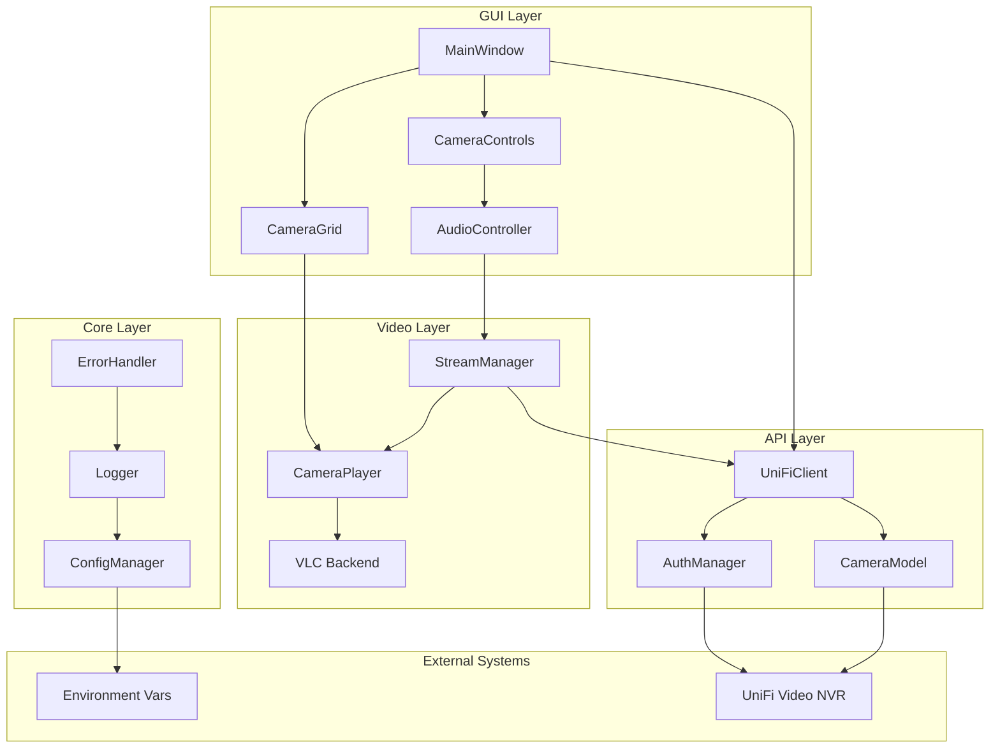
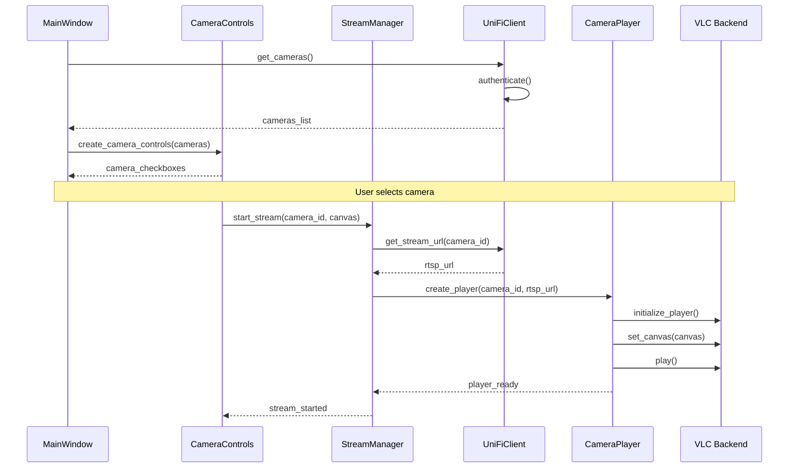
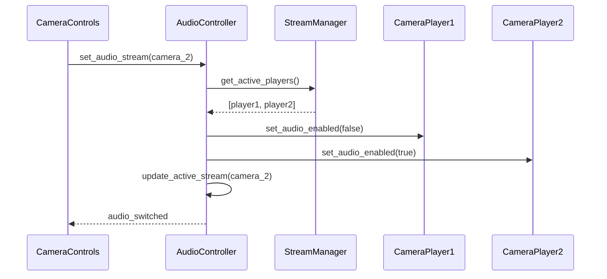

# Design - Camera Live View

## Introduction
This document defines the technical design for implementing the camera live view feature that enables real-time multi-camera surveillance monitoring. The design follows the modular architecture patterns established in structure.md and leverages the technology stack specified in tech.md, providing a scalable foundation for security personnel to monitor UniFi Video camera streams.

## Alignment with Steering Documents
This design aligns with the established project standards:
- **Architecture**: Follows structure.md module organization (api/, gui/, video/, utils/, models/)
- **Technology Stack**: Uses Python 3.13.5, FreeSimpleGUI, python-vlc per tech.md specifications
- **Product Goals**: Supports efficient multi-camera surveillance from product.md vision
- **Performance**: Addresses <3 second latency and 4+ simultaneous streams from requirements

## Code Reuse Analysis

### Existing Components to Leverage
Based on structure.md project organization, the following existing infrastructure can be leveraged:

#### Utilities Module (src/utils/)
- **ConfigManager** (`src/utils/config.py`): Leverage existing configuration management for environment variables and settings
- **Logger** (`src/utils/logger.py`): Use established logging infrastructure for error tracking and debugging
- **Helpers** (`src/utils/helpers.py`): Utilize common utility functions for validation and data processing

#### Models Module (src/models/)
- **Base Model Patterns**: Follow existing model conventions for Camera and StreamInfo data structures
- **Validation Patterns**: Reuse existing data validation approaches from project structure

#### API Integration Patterns
- **Session Management**: Build upon existing patterns from structure.md for HTTP client session handling
- **Error Handling**: Leverage existing error hierarchy (GeekTimeCamError, APIError, etc.) from structure.md
- **JSON Processing**: Use established patterns for API response processing

### Integration Points
- **Configuration System**: Integrate with existing `config/settings.ini` and environment variable management
- **Logging Infrastructure**: Connect with established logging configuration in `config/logging.conf`
- **Project Structure**: Follow established import patterns and directory organization from structure.md
- **Testing Framework**: Build upon existing test structure in `tests/` directory with appropriate test fixtures

### New Components Required
Since this is a greenfield project, most components will be newly created following the established patterns:
- GUI components (MainWindow, CameraGrid, CameraControls) - new implementations
- Video processing (StreamManager, CameraPlayer, AudioController) - new implementations
- API client (UniFiClient, AuthManager) - new implementations following existing patterns

## High-Level Architecture



## Component Design

### GUI Module Components

#### MainWindow (src/gui/main_window.py)
**Purpose**: Primary application window and layout management for the camera live view interface

**Interfaces**:
```python
class MainWindow:
    def __init__(self, config: ConfigManager):
        self.window: sg.Window
        self.camera_grid: CameraGrid
        self.controls: CameraControls
        self.stream_manager: StreamManager

    def initialize_layout(self) -> List[List[sg.Element]]
    def handle_events(self) -> None
    def switch_view_mode(self, mode: ViewMode) -> None
    def cleanup(self) -> None
```

**Dependencies**:
- `FreeSimpleGUI` for window management
- `CameraGrid` for video display coordination
- `CameraControls` for user interaction handling
- `StreamManager` for stream lifecycle management
- `ConfigManager` from utils module for configuration

**Reuses**:
- `ConfigManager` from `src/utils/config.py` for settings management
- `Logger` from `src/utils/logger.py` for application event logging
- Error handling patterns from `src/utils/helpers.py`

#### CameraGrid (src/gui/camera_grid.py)
**Purpose**: Dynamic video display grid management and layout coordination for multiple camera streams

**Interfaces**:
```python
class CameraGrid:
    def __init__(self, parent_window: sg.Window):
        self.cameras: Dict[str, CameraPlayer]
        self.layout_mode: ViewMode
        self.canvas_widgets: Dict[str, sg.Canvas]

    def add_camera(self, camera_id: str, player: CameraPlayer) -> None
    def remove_camera(self, camera_id: str) -> None
    def update_layout(self) -> None
    def switch_to_focus(self, camera_id: str) -> None
    def switch_to_grid(self) -> None
```

**Dependencies**:
- `FreeSimpleGUI.Canvas` for video display containers
- `CameraPlayer` for individual stream management
- Grid layout calculation algorithms

**Reuses**:
- Layout utility functions from `src/utils/helpers.py`
- Configuration settings from `ConfigManager` for display preferences
- Logging infrastructure for layout change tracking

#### CameraControls (src/gui/controls.py)
**Purpose**: User interaction controls and camera management interface components

**Interfaces**:
```python
class CameraControls:
    def __init__(self, stream_manager: StreamManager):
        self.stream_manager: StreamManager
        self.camera_checkboxes: Dict[str, sg.Checkbox]
        self.audio_selector: sg.Combo

    def create_camera_controls(self, cameras: List[Camera]) -> List[sg.Element]
    def handle_camera_selection(self, camera_id: str, selected: bool) -> None
    def handle_audio_selection(self, camera_id: str) -> None
    def update_status_indicators(self) -> None
```

**Dependencies**:
- `StreamManager` for stream control operations
- `FreeSimpleGUI` widgets for UI controls
- `Camera` model for control generation

**Reuses**:
- Configuration persistence from `ConfigManager` for user preferences
- Validation utilities from `src/utils/helpers.py`
- Event handling patterns from project structure

### Video Module Components

#### StreamManager (src/video/stream_manager.py)
**Responsibility**: Multi-stream coordination and lifecycle management
**Key Features**:
- Independent camera stream management
- Stream state coordination
- Performance optimization
- Error handling and recovery

**Interface**:
```python
class StreamManager:
    def __init__(self, unifi_client: UniFiClient):
        self.active_streams: Dict[str, CameraPlayer]
        self.client: UniFiClient
        self.audio_controller: AudioController

    def start_stream(self, camera_id: str, canvas: sg.Canvas) -> CameraPlayer
    def stop_stream(self, camera_id: str) -> None
    def restart_stream(self, camera_id: str) -> None
    def get_stream_status(self, camera_id: str) -> StreamStatus
    def cleanup_all_streams(self) -> None
```

#### CameraPlayer (src/video/player.py)
**Responsibility**: Individual camera VLC player management
**Key Features**:
- VLC media player wrapper
- RTSP/RTMP stream handling
- Audio control integration
- Performance monitoring

**Interface**:
```python
class CameraPlayer:
    def __init__(self, camera_id: str, stream_url: str):
        self.camera_id: str
        self.player: vlc.MediaPlayer
        self.canvas: sg.Canvas
        self.status: StreamStatus

    def start_playback(self, canvas: sg.Canvas) -> None
    def stop_playback(self) -> None
    def set_audio_enabled(self, enabled: bool) -> None
    def get_stream_info(self) -> StreamInfo
    def handle_errors(self) -> None
```

#### AudioController (src/video/audio_controller.py)
**Responsibility**: System-wide audio management and routing
**Key Features**:
- Single-stream audio enforcement
- Audio switching coordination
- Volume control
- Audio status tracking

**Interface**:
```python
class AudioController:
    def __init__(self):
        self.active_audio_stream: Optional[str]
        self.muted_streams: Set[str]

    def set_audio_stream(self, camera_id: str) -> None
    def mute_all_streams(self) -> None
    def get_audio_status(self) -> AudioStatus
    def handle_audio_conflicts(self) -> None
```

### API Module Components

#### UniFiClient (src/api/client.py)
**Responsibility**: UniFi Video API integration and communication
**Key Features**:
- RESTful API communication
- Session management
- Rate limiting and retry logic
- Response validation

**Interface**:
```python
class UniFiClient:
    def __init__(self, config: ConfigManager):
        self.session: requests.Session
        self.auth_manager: AuthManager
        self.base_url: str

    def login(self) -> bool
    def get_cameras(self) -> List[Camera]
    def get_stream_url(self, camera_id: str) -> str
    def get_camera_snapshot(self, camera_id: str) -> bytes
    def check_connection(self) -> bool
```

#### AuthManager (src/api/auth.py)
**Responsibility**: Authentication flow and session management
**Key Features**:
- Cookie-based authentication (JSESSIONID_AV)
- Automatic session renewal
- Credential validation
- Security compliance

**Interface**:
```python
class AuthManager:
    def __init__(self, config: ConfigManager):
        self.credentials: AuthCredentials
        self.session_cookie: Optional[str]
        self.expiry_time: Optional[datetime]

    def authenticate(self) -> AuthResult
    def refresh_session(self) -> bool
    def is_session_valid(self) -> bool
    def logout(self) -> None
```

### Data Models

#### Camera (src/models/camera.py)
**Responsibility**: Camera entity and state representation
```python
@dataclass
class Camera:
    id: str
    name: str
    host: str
    stream_url: Optional[str]
    snapshot_url: Optional[str]
    status: CameraStatus
    recording_enabled: bool

class CameraStatus(Enum):
    ONLINE = "online"
    OFFLINE = "offline"
    CONNECTING = "connecting"
    ERROR = "error"
```

#### StreamInfo (src/models/streaming.py)
**Responsibility**: Stream metadata and performance tracking
```python
@dataclass
class StreamInfo:
    camera_id: str
    resolution: Tuple[int, int]
    fps: float
    bitrate: int
    latency_ms: int
    last_frame_time: datetime
    error_count: int
```

## Data Flow

### Stream Initialization Flow


### Audio Control Flow


## Integration Points

### UniFi Video API Integration
**Endpoints Used**:
- `POST /api/2.0/login` - Authentication
- `GET /api/2.0/camera/` - Camera discovery
- `GET /api/2.0/stream/{camera_id}/{channel}/url` - Stream URLs
- `GET /api/2.0/snapshot/camera/{camera_id}` - Snapshots

**Authentication Flow**:
1. Retrieve credentials from environment variables
2. POST to login endpoint with credentials
3. Extract JSESSIONID_AV cookie from response
4. Include cookie in all subsequent requests
5. Handle session expiration with automatic re-authentication

### VLC Integration
**Embedding Strategy**:
- Use FreeSimpleGUI Canvas widgets as video containers
- Extract canvas widget handle using `canvas.Widget.winfo_id()`
- Set VLC player output window to canvas handle
- Configure VLC instance with appropriate options for embedded playback

**Threading Model**:
- Each camera stream runs in independent thread
- GUI updates coordinated through thread-safe event system
- VLC callbacks handled in dedicated callback threads

### Configuration Integration
**Environment Variables** (per structure.md):
```
UNIFIVIDEO_HOST=https://nvr.company.com
UNIFIVIDEO_USERNAME=security_user
UNIFIVIDEO_PASSWORD=secure_password
LOG_LEVEL=INFO
```

**Settings Management**:
- Runtime preferences stored in `config/settings.ini`
- Camera selection state persistence
- View mode preferences
- Audio settings memory

## Error Scenarios

### Network Connection Failures
**Scenario**: Loss of network connectivity to UniFi Video NVR system
**Handling**:
- Automatic retry with exponential backoff (1s, 2s, 4s, 8s intervals)
- Display connection status indicator to user
- Continue operation with cached camera list until reconnection
**User Impact**: Temporary loss of live streams, graceful degradation to cached data

### Authentication Session Expiry
**Scenario**: JSESSIONID_AV cookie expires during operation
**Handling**:
- Automatic re-authentication using stored environment credentials
- Transparent session renewal without user interruption
- Fallback to login dialog if automatic renewal fails
**User Impact**: Brief interruption of 1-2 seconds during re-authentication

### Individual Stream Failures
**Scenario**: Single camera stream becomes unavailable or corrupted
**Handling**:
- Restart individual stream without affecting other cameras
- Fallback to snapshot display if stream restart fails
- Mark camera as offline in status indicators
**User Impact**: Single camera temporarily unavailable while others continue normally

### VLC Player Initialization Errors
**Scenario**: VLC player fails to initialize or embed in canvas
**Handling**:
- Log detailed error information for debugging
- Display error message in camera panel
- Attempt player recreation with fallback parameters
**User Impact**: Specific camera panel shows error state, other cameras unaffected

### Resource Exhaustion
**Scenario**: System runs out of memory or CPU resources
**Handling**:
- Reduce stream quality settings automatically
- Limit number of concurrent streams if necessary
- Clean up unused video buffers and memory leaks
**User Impact**: Reduced video quality or stream count to maintain stability

### API Response Validation Failures
**Scenario**: UniFi Video API returns unexpected or malformed data
**Handling**:
- Validate all API responses against expected schema
- Log detailed error information for debugging
- Use cached data when available, prompt user when not
**User Impact**: Graceful fallback to last known good data, clear error messaging

## Performance Considerations

### Resource Management
- **Memory**: VLC buffer size optimization, periodic cleanup
- **CPU**: Thread pool management, frame rate limiting
- **Network**: Adaptive bitrate based on connection quality
- **GPU**: Hardware acceleration when available

### Scalability Design
- **Concurrent Streams**: Support 4+ simultaneous streams per requirements
- **Memory Footprint**: <500MB for 4 streams target
- **CPU Usage**: <30% utilization on modern systems
- **Network Bandwidth**: Adaptive quality based on available bandwidth

## Security Considerations

### Credential Management
- Environment variable storage only (no embedded secrets)
- Secure memory handling for authentication tokens
- Automatic session cleanup on application exit
- No persistent credential storage

### Network Security
- HTTPS enforcement when supported by NVR
- Certificate validation for secure connections
- Input validation for all API responses
- Protection against injection attacks

## Testing Strategy

### Component Testing
- **Unit Tests**: Individual component functionality
- **Integration Tests**: API client and VLC integration
- **GUI Tests**: User interaction validation
- **Performance Tests**: Stream latency and resource usage

### Test Coverage
- Authentication flow and error handling
- Stream lifecycle management
- Multi-camera coordination
- Audio switching functionality
- Error recovery mechanisms